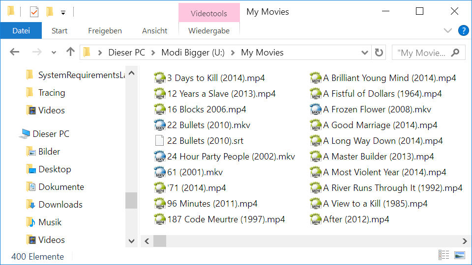

# Movies

A movie is a video telling a fictive story by the use of actors or a story or event recorded by a camera as a set of moving images and shown in a theater or on television; a motion picture.  Movies should be only actual movies and not be confused with Documentaries or Series.  Even if a movie is based on a real story it is no documentary.  Some sample movies are...

When the name of a movie is processed, it is reduced according to certain criteria to ease the matching of the movies.  MFM tries to cleanup Movie names, by cutting them of before the year, in the files name.  If no year is found it is tried to clean up the name according to some other criteria.  However, the better the naming of the files is that better MFM works.

The recommended naming format for movies is…

`Movie Title` (`year`)

]

The important thing is that the year is immediately after the name.  If round brackets are used or not is not that important and the main reason is readability.

I would recommend having no sub-folders for each movie.  If you want to can separate your movies somehow according to genres, but the challenge with this implementation is that all movies are of more than one genre, like action comedy or a romance drama.  To get a good overview of all the stuff you have you can use a database program like the Personal Video Database.  PVD can download information from the IMDb.  With PVD you can mark you movies as seen and filter or sort them according to many criteria.
